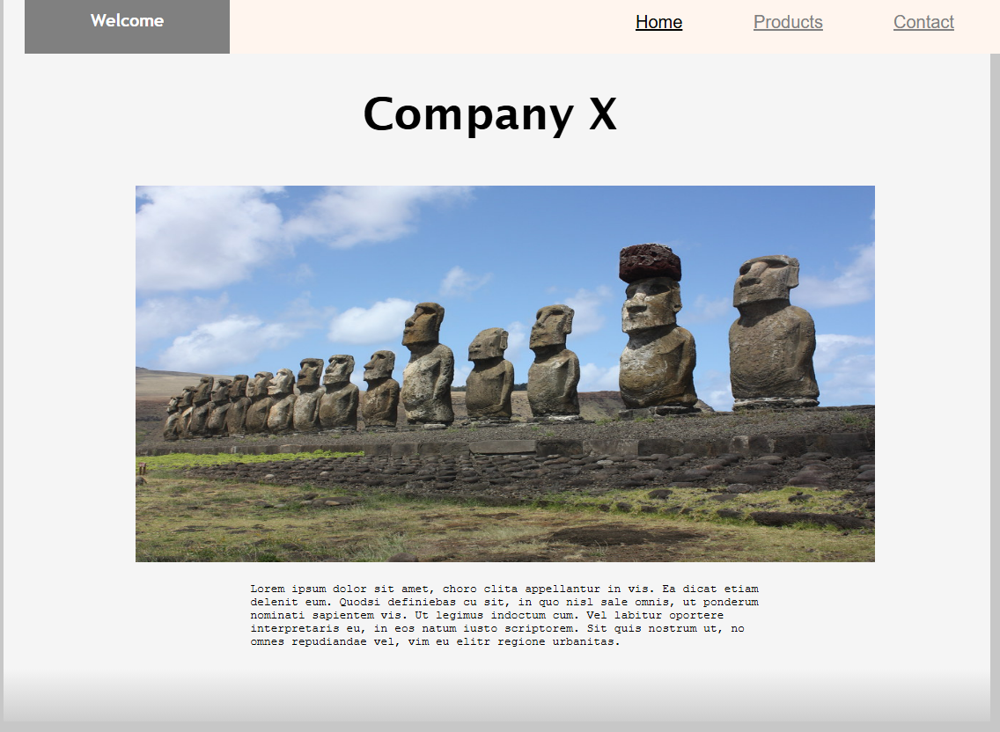

  
<h1> Introduction </h1>

Hello! I'm Elias, a fledgling game and software developer with a strong passion for discovery, storytelling, and learning. As a developer, I thrive on designing systems and narratives that captivate the user's mind. What I aspire to do is lift heavy ideas and bring them to life. 

Aiming to merge my creativity with technical skills, creating engaging and inspiring projects is more than just a career goal - It's something deeply personal and dear to my heart. Just as I have been inspired by technology and stories, I dream of creating interesting concepts that inspire others and leave a lasting impact. 

  

My curiosity towards programming languages extends to regular old speaking languages, too. As a fluent speaker of both English and Finnish, I aim to participate in thought-provoking and enriching conversations using both languages. I am currently delving into Swedish, hoping to add it to my repertoire. Delving into its nuances helps me connect with a larger community as well as deepens my appreciation for complex languages themselves. 

   

<h1> Education </h1>

 
Currently enrolled as a Second Year student at Metropolia University of Applied Sciences, studying Information and Communication technology. During my stay at Metropolia, I have been given countless opportunities to create & bring to life fascinating concepts, be it in code, writing or conceptual design. 

Honorably completed courses in both Math and Physics,  demonstrating an understanding of the foundations and principles that support logical thinking as well as problem-solving - Both vital skills that I have learned to apply to my programming work.

 

<h1> Projects & Experience </h1>

  

    <h2>Tank City</h2>
    <a target="_blank" href="https://eliasvaa.itch.io/tank-city">
      
      

    </a>
    
 Challenging and entertaining 2D Tank Shooter where the players must eliminate enemy tank controlled by 
      advanced artificial intelligence capable of mounting a formidable defense. Playable now on Itch.io via WebGL conversion. 

  

  

    <h2>Heart Monitor</h2>
    
    
 Fully functional and accurate device programmed using a Raspberry Pi Pico, MicroPython and MQTT. Able to 
      read not only the user's heart rate, but HRV, SSDN and RMSSD values. Worked as the team's lead programmer, creating the algorithm, calculations and visuals

  

  

    <h2>Website</h2>
    <a target="_blank" href="https://users.metropolia.fi/~eliasvaa/htmlproj/home.html">
      
      

    </a>
    
 A simple HTML website consisting of three unique pages

  

  

    <h2>Flight Game</h2>
    
  
 A Python project utilizing SQL databases in order to create a thrilling guessing game of real airports found around the world. 

  

